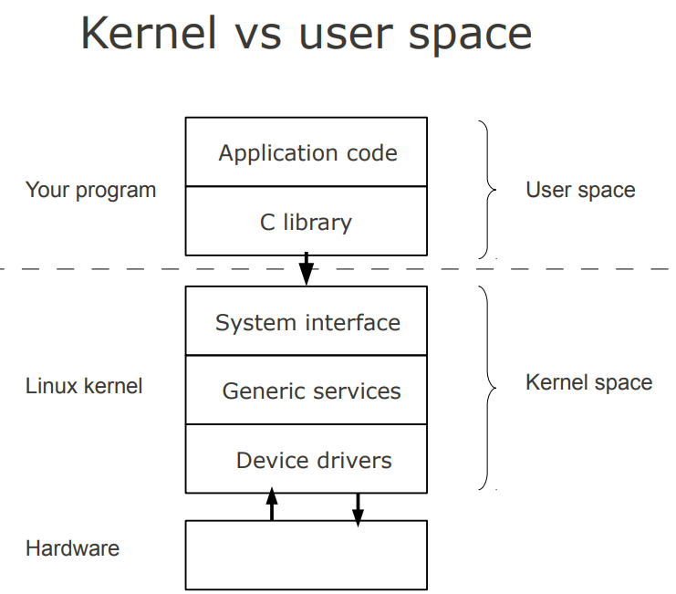

# Introduction #

Linux is a free open source operating system (OS) based on UNIX that was created in 1991 by Linus Torvalds. Users can modify and create variations of the source code, known as distributions, for computers and other devices.

## Linux Architecture ## 

Linux is primarily divided into User Space & Kernel Space. These two components interact through a System Call Interface – which are predefined and matured interface to Linux Kernel for User space applications. The below image will give you the basic understanding.

