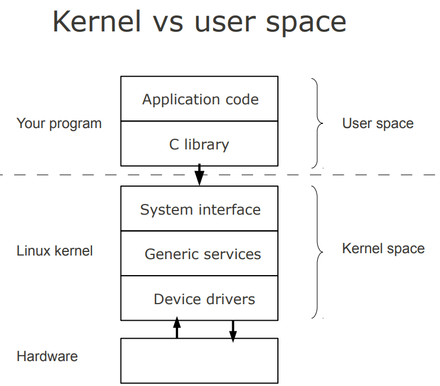

# Introduction #

Linux is a free open source operating system (OS) based on UNIX that was created in 1991 by Linus Torvalds. Users can modify and create variations of the source code, known as distributions, for computers and other devices.

## Linux Architecture ## 

Linux is primarily divided into User Space & Kernel Space. These two components interact through a System Call Interface – which are predefined and matured interface to Linux Kernel for User space applications. The below image will give you the basic understanding.

### Kernel Space ###
Kernel space is where the kernel (i.e., the core of the operating system) executes (i.e., runs) and provides its services.

### User Space ## #
User Space is where the user applications are executed.

## Linux Kernel Modules ##

* Kernel modules are pieces of code that can be loaded and unloaded into the kernel upon demand. They extend the functionality of the kernel without the need to reboot the system.
* Custom codes can be added to Linux kernels via two methods.

The basic way is to add the code to the kernel source tree and recompile the kernel.

A more efficient way is to do this is by adding code to the kernel while it is running. This process is called loading the module, where module refers to the code that we want to add to the kernel.

Since we are loading these codes at runtime and they are not part of the official Linux kernel, these are called loadable kernel module(LKM), which is different from the “base kernel”. Base kernel is located in /boot directory and is always loaded when we boot our machine whereas LKMs are loaded after the base kernel is already loaded. Nonetheless, these LKM are very much part of our kernel and they communicate with base kernel to complete their functions.

LKMs can perform a variety of task, but basically they come under three main categories,

* Device drivers

* Filesystem drivers

* System calls

## Device Drivers ## 

A device driver is designed for a specific piece of hardware. The kernel uses it to communicate with that piece of hardware without having to know any details of how the hardware works.

### Filesystem drivers ###
A filesystem driver interprets the contents of a filesystem (which is typically the contents of a disk drive) as files and directories and such. There are lots of different ways of storing files and directories and such on disk drives, on network servers, and in other ways. For each way, you need a filesystem driver. For example, there’s a filesystem driver for the ext2 filesystem type used almost universally on Linux disk drives. There is one for the MS-DOS filesystem too, and one for NFS.

### System cals ###
User space programs use system calls to get services from the kernel. For example, there are system calls to read a file, to create a new process, and to shut down the system. Most system calls are integral to the system and very standard, so are always built into the base kernel (no LKM option).

But you can invent a system call of your own and install it as an LKM. Or you can decide you don’t like the way Linux does something and override an existing system call with an LKM of your own.

## Advantages of LKM
One major advantage they have is that we don’t need to keep rebuilding the kernel every time we add a new device or if we upgrade an old device. This saves time and also helps in keeping our base kernel error free.

LKMs are very flexible, in the sense that they can be loaded and unloaded with a single line of command. This helps in saving memory as we load the LKM only when we need them.

## Differences Between Kernel Modules and User Programs ##

**Kernel modules have separate address space**. A module runs in kernel space. An application runs in user space. System software is protected from user programs. Kernel space and user space have their own memory address spaces.

**Kernel modules have higher execution privilege**. Code that runs in kernel space has greater privilege than code that runs in user space.

**Kernel modules do not execute sequentially**. A user program typically executes sequentially and performs a single task from beginning to end. A kernel module does not execute sequentially. A kernel module registers itself in order to serve future requests.

**Kernel modules use different header files**. Kernel modules require a different set of header files than user programs require.

## Difference Between Kernel Drivers and Kernel Modules ##

A kernel module is a bit of compiled code that can be inserted into the kernel at run-time, such as withinsmod or modprobe.

A driver is a bit of code that runs in the kernel to talk to some hardware device. It “drives” the hardware. Most every bit of hardware in your computer has an associated driver.

## Types ##

In the traditional classification, there are three kinds of device:

* Character device
* Block device
* Network device

In Linux everything is a file. I mean Linux treat everything as a File even hardware.

### Character Device ###
A char file is a hardware file which reads/write data in character by character fashion. Some classic examples are keyboard, mouse, serial printer. If a user use a char file for writing data no other user can use same char file to write data which blocks access to other user. Character files uses synchronize Technic to write data. Of you observe char files are used for communication purpose and they can not be mounted.

### Block Device ###
A block file is a hardware file which read/write data in blocks instead of character by character. This type of files are very much useful when we want to write/read data in bulk fashion. All our disks such are HDD, USB and CDROMs are block devices. This is the reason when we are formatting we consider block size. The write of data is done in asynchronous fashion and it is CPU intensive activity. These devices files are used to store data on real hardware and can be mounted so that we can access the data we written.

### Network Device ###
A network device is, so far as Linux’s network subsystem is concerned, an entity that sends and receives packets of data. This is normally a physical device such as an ethernet card. Some network devices though are software only such as the loopback device which is used for sending data to yourself.

**This is all about the basics of Linux and device driver. Now we will create our first driver.**

